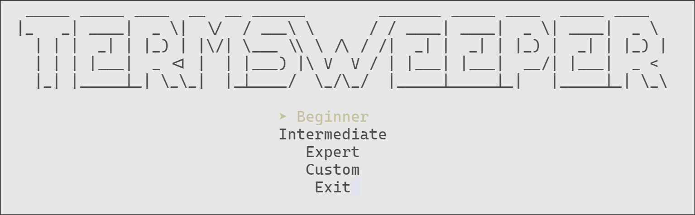

# Termsweeper

A minimal terminal-based Minesweeper game written in Rust, using `crossterm` for cross-platform terminal UI.

## Features

- Classic Minesweeper gameplay
- Mouse controls
- Multiple difficulty levels (Beginner, Intermediate, Expert)
- Custom board configuration
- Colorful terminal UI

### Controls

- **Arrow Keys**: Navigate menus
- **Enter**: Select menu item
- **Esc** or **Ctrl+C**: Exit game
- **r**: Restart game (after win/loss)
- **m**: Return to main menu (after win/loss)
- **Mouse Left Click**: Reveal cell
- **Mouse Right Click**: Flag/unflag cell
- **Left/Right Arrow (Custom Menu)**: Decrease/increase custom values

### Usage

Add this crate to your dependencies in `Cargo.toml`:

```toml
[dependencies]
termsweeper = "0.1.0"
```

Then, in your code:

```rust
use termsweeper::game_logic::Board;

fn main() {
    let mut board = Board::new();
    // ... interact with the board, or run the game loop
}
```

### How to Run

1. Make sure you have Rust installed: https://rustup.rs
2. Clone the repository:
   ```
   git clone <repo-url>
   cd termsweeper
   ```
3. Build and run:
   ```
   cargo run --release
   ```

### Custom Game

Select "Custom" in the main menu to set your own board width, height, and number of mines. Use left/right arrows to adjust values, then select "Confirm" to start.

### Screenshots



### Todo
- [x] Add timer to track game duration.
- [x] Add mine counter to display unflagged mines.
- [ ] Fix custom menu min and max values.
- [ ] Add a high score leaderboard.
- [ ] Refactor to make error handling more consistent.
- [ ] Refactor tui.rs code to be more modular.
- [ ] Add Themes.

### Dependencies

- [crossterm](https://crates.io/crates/crossterm)
- [rand](https://crates.io/crates/rand)
- [anyhow](https://crates.io/crates/anyhow)
